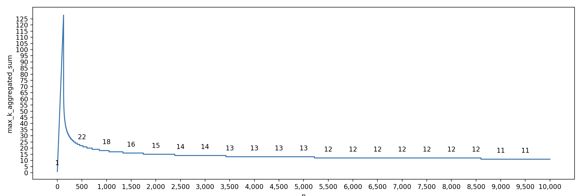

# Computing Properties of Binomial Coefficients

###  *required for the MuSKeR BLS aggregation project

This script is a Python implementation for computing properties of binomial coefficients. It computes various properties
of the binomial coefficient C(n, k) for n, such as the minimum value of k for which the sum of C(n, k) for k in the 
range [0, k_min] is less than or equal to 2^128, the largest integer value of k that we can tolerate such that 
C(n, k) < threshold, etc. The script writes the computed properties to a CSV file named combinations.csv.

## Requirements
- Python 3.6 or above
- csv module
- math module
- matplotlib module

## Usage
Clone the repository: `git clone https://github.com/your_username/combinations-computation.git`

Change the directory: `cd combinations-computation/`

Run the code: `python combinations.py`

The output will be a CSV file named combinations.csv containing the computed properties of the binomial coefficients for
values of n up to 10000.

## How it works
The program computes the minimum value of k for which the aggregated number of combinations is less than 2^128, and the 
first value of k C(n, k) > threshold. It also computes the largest integer value of k that we can tolerate such that 
C(n, k) < threshold.

The program caches the factorials for n = 0 and n = 1 and uses them to compute the factorials of larger values of n. 
This allows for faster computation of binomial coefficients using the formula C(n, k) = n! / (k! * (n - k)!).

The program uses the csv module to write the computed properties to a CSV file named combinations.csv. It also uses the 
`matplotlib` module to create a scatter plot of the values of log(C(n, k)) for different values of n and k.

#### Example output for up to `n = 300` and `n = 10000`, respectively.

  

  

## Functions
The code contains two main functions:

---
`factorial(n)`

Computes the factorial of a non-negative integer n.

**Arguments**

`n`: The non-negative integer to compute the factorial of.

**Returns**
The factorial of `n`.

---
`compute_combinations(n)`

Computes various properties of the binomial coefficient C(n, k) for an integer n.

**Arguments**

`n`: The integer to compute the properties for.

**Returns**

A tuple containing:

`n`: The integer passed as an argument.

`min_k_for_aggregated_combinations`: The minimum value of k such that the sum of C(n, k) for k in the range [0, k_min] 
is less than or equal to 2^128.

`log_sum_of_combinations_min_k_aggregated_combinations`: The base-2 logarithm of the sum of C(n, k) for k in the range 
[0, min_k_for_aggregated_combinations].

`sum_of_combinations_min_k_aggregated_combinations`: The integer value of the sum of C(n, k) for k in the range 
[0, min_k_for_aggregated_combinations].

`min_k`: The largest integer value of k that we can tolerate such that C(n, min_k) < threshold.

`log_combinations_min_k`: The base-2 logarithm of C(n, min_k).

`combinations_min_k`: The integer value of C(n, min_k).

`max_k`: The first integer where C(n, max_k) > threshold.

`log_combinations_max_k`: The base-2 logarithm of C(n, max_k).

`combinations_max_k`: The integer value of C(n, max_k).

## Contributors
Konstantinos Chalkias, Arnab Roy and Foteini Baldimtsi